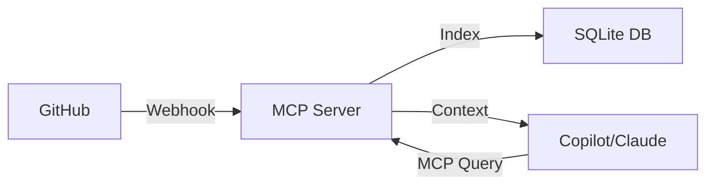

# mcp-github-memory

This Model Context Protocol (MCP) server indexes your GitHub PRs and commits, making them searchable by GitHub Copilot, Claude, or any MCP-compatible AI assistant.

## 🏗️ Architecture



## Features

- **GitHub Webhook Integration**: Automatically indexes pull requests and commits as they happen
- **MCP Query Interface**: Provides tools for AI assistants to search and retrieve indexed data
- **SQLite Storage**: Efficient local storage for PR and commit data
- **Dual Mode Operation**: Run as webhook server or MCP server

## Installation

```bash
npm install
npm run build
```

## Usage

### MCP Server Mode

Run as an MCP server for AI assistants to query:

```bash
node dist/index.js mcp
```

Or use the npm script:

```bash
npm start
```

### Webhook Server Mode

Run as a webhook server to receive GitHub events:

```bash
node dist/index.js webhook
```

The webhook server will listen on port 3000 by default. Configure with environment variables:

```bash
WEBHOOK_PORT=3000 GITHUB_WEBHOOK_SECRET=your-secret node dist/index.js webhook
```

### Configuration

Environment variables:

- `GITHUB_MEMORY_DB_PATH`: Path to SQLite database (default: `./github-memory.db`)
- `WEBHOOK_PORT`: Port for webhook server (default: `3000`)
- `GITHUB_WEBHOOK_SECRET`: Optional webhook secret for verification

## MCP Configuration

Add to your MCP settings file (e.g., Claude Desktop config):

```json
{
  "mcpServers": {
    "github-memory": {
      "command": "node",
      "args": ["/path/to/mcp-github-memory/dist/index.js", "mcp"]
    }
  }
}
```

## Available Tools

### search_pull_requests

Search indexed pull requests by query, repository, author, or state.

**Parameters:**
- `query` (string): Search query to match against PR title and body
- `repository` (string): Filter by repository (e.g., "owner/repo")
- `author` (string): Filter by author username
- `state` (string): Filter by state (open, closed, merged)

### get_pull_request

Get details of a specific pull request.

**Parameters:**
- `repository` (string, required): Repository name (e.g., "owner/repo")
- `number` (number, required): Pull request number

### search_commits

Search indexed commits by message, repository, or author.

**Parameters:**
- `query` (string): Search query to match against commit messages
- `repository` (string): Filter by repository (e.g., "owner/repo")
- `author` (string): Filter by author username

### get_commit

Get details of a specific commit.

**Parameters:**
- `id` (string, required): Commit SHA

## GitHub Webhook Setup

1. Go to your repository settings on GitHub
2. Navigate to Webhooks → Add webhook
3. Set Payload URL to your webhook server (e.g., `http://your-server:3000/webhook`)
4. Set Content type to `application/json`
5. Select individual events:
   - Pull requests
   - Pushes
6. Add webhook (optionally set a secret)

## Database Schema

### pull_requests table

- `id`: Pull request ID
- `number`: PR number
- `title`: PR title
- `body`: PR description
- `state`: PR state (open, closed, merged)
- `author`: Author username
- `repository`: Repository full name
- `url`: PR URL
- `created_at`: Creation timestamp
- `updated_at`: Last update timestamp

### commits table

- `id`: Commit SHA
- `message`: Commit message
- `author`: Author username
- `repository`: Repository full name
- `url`: Commit URL
- `timestamp`: Commit timestamp

## Development

Build the project:

```bash
npm run build
```

Watch for changes:

```bash
npm run watch
```

## License

MIT
