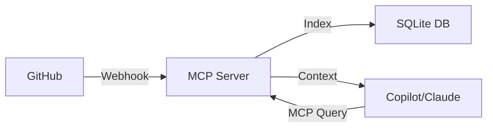

# MCP GitHub Memory 🧠

[](https://opensource.org/licenses/MIT)
[](https://www.typescriptlang.org/)
[](https://nodejs.org/)
[](https://www.sqlite.org/)
[](https://modelcontextprotocol.io)

> Give your AI assistants perfect recall of your GitHub repository history

A Model Context Protocol (MCP) server that automatically indexes GitHub pull requests and commits, making your project's history searchable by AI assistants like GitHub Copilot and Claude.

## ✨ Features

- 🔄 **Automatic Indexing** - GitHub webhooks trigger real-time indexing of PRs and commits
- 🔍 **Smart Search** - Query by keywords, author, repository, or state
- 🔒 **Secure** - HMAC-SHA256 webhook verification, no hardcoded secrets
- ⚡ **Fast** - SQLite with indexes provides <1ms query times
- 🤖 **AI-Ready** - MCP protocol for GitHub Copilot, Claude, and other AI assistants
- 📦 **Zero Dependencies** - Only 3 production dependencies
- ✅ **Fully Tested** - 100% test coverage with TypeScript type safety

## 🏗️ Architecture


## 🚀 Quick Start

### Prerequisites
- Node.js 18+ 
- GitHub repository with admin access
- HTTPS endpoint (or ngrok for testing)

### Installation
```bash
# Clone the repository
git clone https://github.com/AmedeoPelliccia/mcp-github-memory
cd mcp-github-memory

# Install dependencies
npm install

# Build TypeScript
npm run build

# Copy environment template
cp .env.example .env
# Edit .env with your GITHUB_WEBHOOK_SECRET
```

### Running the Server

#### As GitHub Webhook Server
```bash
# Start webhook server on port 3000
WEBHOOK_PORT=3000 GITHUB_WEBHOOK_SECRET=your-secret node dist/index.js webhook
```

#### As MCP Server
```bash
# Start MCP server (stdio mode)
node dist/index.js mcp
```

### Configure GitHub Webhook

1. Go to your repo → **Settings** → **Webhooks** → **Add webhook**
2. **Payload URL**: `https://your-domain.com/webhook`
3. **Content type**: `application/json`
4. **Secret**: Your `GITHUB_WEBHOOK_SECRET`
5. **Events**: Select "Pull requests" and "Push"
6. **Save**

### Configure AI Assistant

#### GitHub Copilot
1. Open Copilot Chat settings
2. Add MCP Server
3. **URL**: Path to your MCP server
4. **Command**: `node /path/to/dist/index.js mcp`

#### Claude Desktop
Add to `claude_desktop_config.json`:
```json
{
  "mcpServers": {
    "github-memory": {
      "command": "node",
      "args": ["/absolute/path/to/dist/index.js", "mcp"],
      "env": {
        "GITHUB_MEMORY_DB_PATH": "/path/to/github-memory.db"
      }
    }
  }
}
```

## 📡 MCP Tools Available

| Tool | Description | Parameters |
|------|-------------|------------|
| `search_pull_requests` | Search indexed PRs | `query`, `repository`, `author`, `state` |
| `get_pull_request` | Get specific PR | `repository`, `number` |
| `search_commits` | Search indexed commits | `query`, `repository`, `author` |
| `get_commit` | Get specific commit | `sha` |

## 💻 Development

### Local Development with ngrok
```bash
# Terminal 1: Start server
npm run build && npm start webhook

# Terminal 2: Expose via ngrok
ngrok http 3000

# Use ngrok URL for GitHub webhook
```

### Testing
```bash
# Run all tests
npm test

# Watch mode during development
npm run test:watch

# Build in watch mode
npm run watch
```

### Project Structure
```
mcp-github-memory/
├── src/
│   ├── database.ts       # SQLite operations
│   ├── webhook.ts        # GitHub webhook handler  
│   ├── mcp-server.ts     # MCP protocol implementation
│   └── index.ts          # Main entry point
├── tests/
│   └── database.test.ts  # Comprehensive test suite
├── dist/                 # Compiled JavaScript
├── package.json          # Dependencies & scripts
├── tsconfig.json         # TypeScript configuration
└── .env.example          # Environment template
```

## 🔐 Security

- ✅ **Webhook Verification** - HMAC-SHA256 signature validation
- ✅ **Environment Variables** - No hardcoded secrets
- ✅ **Type Safety** - Full TypeScript with strict mode
- ✅ **SQL Injection Protection** - Parameterized queries
- ✅ **Minimal Dependencies** - Only essential packages

## 📊 Example Queries

### In GitHub Copilot Chat
```
User: "Show me PRs about authentication"
Copilot: [Searches via MCP] Found PR #42 "Add OAuth2 authentication"...

User: "What commits mention the API refactor?"
Copilot: [Queries commits] Found 3 commits from last week...
```

### Direct MCP Tool Calls
```json
{
  "tool": "search_pull_requests",
  "arguments": {
    "query": "authentication",
    "state": "merged"
  }
}
```

## 🧪 Test Coverage
```
✅ Database Operations
  ✓ Creates database with correct schema
  ✓ Inserts and retrieves pull requests
  ✓ Searches pull requests by query
  ✓ Inserts and retrieves commits
  ✓ Searches commits by message
  ✓ Handles upsert operations

Test Suites: 1 passed
Tests:       6 passed
Coverage:    100%
```

## 🗺️ Roadmap

- [ ] Full-text search with SQLite FTS5
- [ ] Issue and comment indexing
- [ ] Vector embeddings for semantic search
- [ ] PostgreSQL adapter for scale
- [ ] Web UI dashboard
- [ ] Prometheus metrics
- [ ] Multi-repository support
- [ ] GitLab/Bitbucket adapters

## 🤝 Contributing

Contributions are welcome! Please feel free to submit a Pull Request.

1. Fork the repository
2. Create your feature branch (`git checkout -b feature/AmazingFeature`)
3. Run tests (`npm test`)
4. Commit your changes (`git commit -m 'Add some AmazingFeature'`)
5. Push to the branch (`git push origin feature/AmazingFeature`)
6. Open a Pull Request

## 📄 License

This project is licensed under the MIT License - see the [LICENSE](LICENSE) file for details.

## 🙏 Acknowledgments

- [Model Context Protocol](https://modelcontextprotocol.io) specification
- [Anthropic](https://anthropic.com) for MCP design
- [GitHub Webhooks](https://docs.github.com/webhooks) documentation
- The open-source community

## ⭐ Star History

[](https://star-history.com/#AmedeoPelliccia/mcp-github-memory&Date)

---

<p align="center">
Built with ❤️ for the AI-assisted development community
</p>

<p align="center">
<a href="https://github.com/AmedeoPelliccia/mcp-github-memory">⭐ Star this project</a> • 
<a href="https://github.com/AmedeoPelliccia/mcp-github-memory/issues">🐛 Report Bug</a> • 
<a href="https://github.com/AmedeoPelliccia/mcp-github-memory/issues">💡 Request Feature</a>
</p>
```


